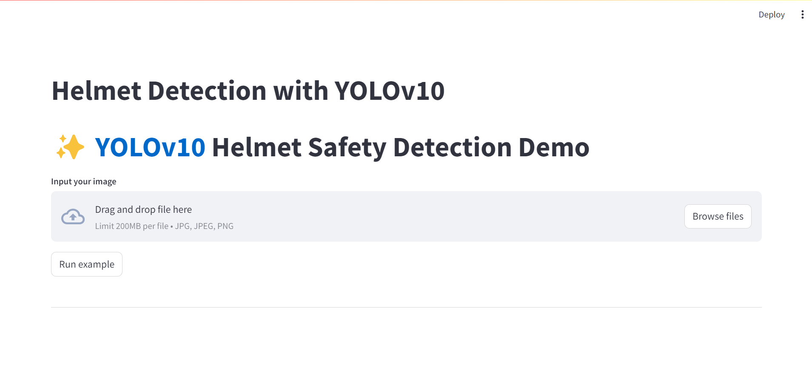

# Helmet-Detection-with-YOLOv10



## Description
A simple web demo for helmet safety detection using YOLOv10 and Streamlit. The pre-trained YOLOv10n will be fine-tuned on Safety helmet dataset. The details of fine-tuning the model is showed in the notebook file.

## How to use

1. Create new conda environment and install required dependencies:
```
$ conda create -n <env_name> -y python=3.11
$ conda activate <env_name>
$ cd yolov10
$ pip install -q -r requirements.txt
$ pip install -e .
```
2. Host streamlit app
```
$ streamlit run app.py
```
